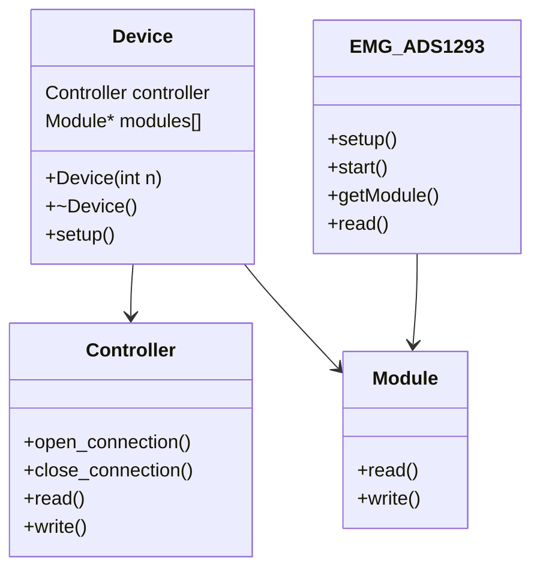

# CleverHand-library
This is the CleverHand library, a library for the CleverHand interface.

## Compatibility
The library is compatible with
- :heavy_check_mark: Linux
- :hammer: Windows (test in progress)
- :hourglass_flowing_sand: MacOS (not tested)

## Available Modules
- :hammer: EMG_ADS1293
- :hourglass_flowing_sand: EMG_ADS1298
- :hourglass_flowing_sand: IMU_BNO055


## Serial Interface
The protocol used to communicate with the CleverHand controller is a simple serial protocol. Each request from the computer to the controller is described in [PROTOCOL.md](docs/PROTOCOL.md).

## Cpp library
The library is written in C++ and is composed of a namespace `ClvHd`, a class `Device` , a class `Controller` and a class abstract class `Module`.
The `Device` class is the main class of the library and contains a `Controller` object and a list of `Module` objects. The `Controller` class is used to communicate with the controller and the `Module` class is an abstract class that represents a module attached to the controller.

As there is an infinite possible type of module, the `Module` class is abstract and the user can create a new class that inherits from `Module` to represent a new type of module. The user must implement static methods to enable the user to use access the module from the `Device` class.



### Device

The `Device` class is the main class of the library and contains a `Controller` object and a list of `Module` objects pointer.
Initially, module array is filled with `nullptr`. When the `setup()` static method of a specific type (e.g. `EMG_ADS1293`) is called, test are made to identify which module have this type, then an instance of the module is created and stored in the module array at the index corresponding to the module id.
**Example**: A controller with 3 ADS1293 modules attached and 1 LIS3DH module attached. When the `setup()` method of the `EMG_ADS1293` class is called, the function will read the RevID register of the 4 modules, the 3 first modules will reply with the correct value and the last module will reply with an error. The `Device` class will create 3 instances of the `EMG_ADS1293` class and store them in the module array at the index corresponding to the module id. Then the `setup()` method of the `LIS3DH` class is called, the function will read the WHO_AM_I register of the remaining uninstanciated module and create an instance of the `LIS3DH` class and store it in the module array at the index corresponding to the module id.

### Controller
The `Controller` class is used to communicate with the controller board. It provides basic functionalities to read/write registers of the modules attached to the controller.

### Module

The `Module` class is an abstract class that represents a module attached to the controller.

### EMG_ADS1293

The `EMG_ADS1293` class is used to read EMG data from the CleverHand board.

## Creating a New Module Type

To create a new module type, follow these steps:

1. **Inherit from the `Module` class**:
    ```cpp
    class NewModuleType : public ClvHd::Module {
    public:
        NewModuleType() { /* Constructor implementation */ }
        ~NewModuleType() { /* Destructor implementation */ }
        // Implement specific methods for the new module
        static void setup(ClvHd::Device &device);
        static void start(ClvHd::Device &device);
        static NewModuleType* getModule(ClvHd::Device &device, int id);
        static uint64_t read(ClvHd::Device &device, double *sample);
    };
    ```

2. **Implement the required static methods**:
    - `setup()`: Detect, instanciate and configure modules of this type attached to the controller.
    - `foo()`: any other methods required to interact with the module.

3. **Use the `Controller` class for communication**: Ensure the new module interacts with the `Device` class to use the `Controller` class for communication with the controller board and the modules array.


## Building the library
### Linux
### Requirements
- CMake
- Make
- build-essential

### Building
```bash
mkdir build
cd build
cmake ..
make
```

## Windows
### Requirements
- CMake

### Building     
```bash
mkdir build
cd build
cmake ..
cmake --build .
```


## Usage
Here's an example of how to use the library in a `main.cpp` file:

```cpp
#include <iostream>
#include <vector>
#include <iomanip>
#include <unistd.h>
#include "ClvHd.h"

int main()
{
    std::cout << "CleverHand Serial Interface:" << std::endl;
    try
    {
        ClvHd::Device device(3);

        // Open the serial connection between the computer and the controller board
        device.controller.open_connection("/dev/ttyACM0", 500000, O_RDWR | O_NOCTTY);
        usleep(500000);

        // Setup the device (count and find the type of modules attached)
        device.setup();

        // Setup the EMG modules
        bool chx_enable[3] = {true, false, false}; // Enable channel 1, disable channels 2 and 3
        int route_table[3][2] = {{0, 1}, {0, 1}, {0, 1}}; // Electrodes configuration
        bool chx_high_res[3] = {true, true, true}; // Enable high resolution mode
        bool chx_high_freq[3] = {true, true, true}; // Enable high frequency mode
        int R1[3] = {4, 4, 4}; // Gain R1 of the INA channels
        int R2 = 4; // Gain R2 of the INA channels
        int R3[3] = {4, 4, 4}; // Gain R3 of the INA channels

        // Create and setup the EMG modules in the device
        ClvHd::EMG_ADS1293::setup(device, chx_enable, route_table, chx_high_res, chx_high_freq, R1, R2, R3);

        // Start the EMG modules
        ClvHd::EMG_ADS1293::start_acquisition(device);

        std::vector<double> sample(6);
        for(int t = 0;; t++)
        {
            uint64_t timestamp = ClvHd::EMG_ADS1293::read_all(device, sample.data());
            std::cout << "timestamp: " << timestamp << " ";
            for(int i = 0; i < 6; i++)
                std::cout << std::fixed << std::setprecision(2) << sample[i] << " ";
            std::cout << std::endl;
            usleep(1000);
        }
    }
    catch(std::exception &e)
    {
        std::cerr << "[ERROR] Got an exception: " << e.what() << std::endl;
    }
    catch(std::string str)
    {
        std::cerr << "[ERROR] Got an exception: " << str << std::endl;
    }

    return 0; // success
}
```
