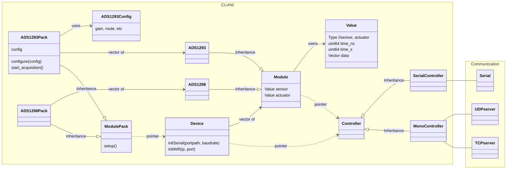

# CleverHand-library
This is library is used to communicate with the CleverHand device. It is written in C++ and integrates a Python wrapper. The library is meant to be modular and easy to use. It enables the user to communicate with the CleverHand device and its different type of modules (read sensors, write actuators, configure parameters, etc.).

> [!WARNING]
> This library is still in development. It is not fully tested and some features may not be available yet. Please raise an issue if you encounter any problem. 


> [!NOTE] 
> The library is originally written for Ubuntu but should work on other OS as well. 


## Architecture



### Device

The `Device` class is the main interface with the cleverhand device; it contains a `Controller` object and a a vector of `Module` objects.
To initialize the `Device` class, you need to call the method `initSerial(portpath)` or `initWifi(ip, port)` to open the serial or TCP connection with the adequate controller. During this initialization, the `Device` class will read the version of the controller and the number of modules attached to it. The `Device` class will then create a vector of `Module` objects, one for each module attached to the controller. 

> [!TIP]
> ```cpp
> ClvHd::Device device();
> device.initSerial("/dev/ttyACM0");
> ```

### Module Pack

The `ModulePack` class is used to group and communicate with multiple modules of the same type attached to the controller. Each type of module has its own class that inherits from the `Module` class. For example, the `EMG_ADS1293Pack`  represents a pack of `EMG_ADS1293` modules. When the device is initialized, you can create a `ModulePack` object for each type of module attached to the controller and call the `setup()` method of each pack to detect the modules of this type attached to the controller. You can then use these pack to configure and read data from the modules.

> [!TIP]
> ```cpp
> ClvHd::Device device;
> device.initSerial("/dev/ttyACM0");
> ClvHd::EMG_ADS1293Pack emg_pack(&device);
> emg_pack.setup();// Detect ADS1293 modules attached to the controller
> ClvHd::EMG_ADS1293Config config;// Create a configuration object for the ADS1293 modules
> emg_pack.configure(config);// Configure the ADS1293 modules with the given configuration
> emg_pack.start_acquisition();// Start the acquisition of the ADS1293 modules
> while(true)
> {
>     vector<ClvHd::Value *> values = emg_pack.read_all();
>     double timestamp = values[0]->time_s + values[0]->time_ns / 1000000.0;// Convert to seconds
>     values[0]->data[0]; // Access the first value of the first
> }
> ```


## Building the library
### Requirements
- CMake
- Make
- build-essential
- (optional: [liblsl](https://github.com/sccn/liblsl))

### Building
```bash
mkdir build
cd build
cmake .. -DBUILD_EXAMPLES=1 -DBUILD_PYTHON=1
make
```

## Usage

### C++
There are several examples in the `src` folder. The examples start with `main_` and showcase different features of the library.

### Python
The library integrates a Python wrapper. To use the library in Python, you need to build the library with the `-DBUILD_PYTHON=1` option. This will create a `clvhd.so` file in the `build` folder. You can then use this file in your Python code.

> [!WARNING]
> The Python wrapper is not fully implemented yet. The library is still in development and some features may not be available in the Python wrapper.


## Serial protocol
Each request from the computer to the controller is a 8 bytes long frame. The first byte is always the command, the rest of the bytes depend on the command. 

### Read 'r' request
Request to read a register from a module attached to the controller. 
1. 'r': read commad
2. id : A 32-bits mask indicating which module to address. **Note**: 0b0110 address module 1 and 2
3. n  : number of bytes to read
4. nc: number of bytes of the command
5. cmd: read command to be sent to the module


**Note**: The number of bytes replyed by the controller `len` is equal to `n`*N with N the number of modules addressed by the id mask.


```wavedrom
{ signal: [
  { name: 'Tx', wave: 'x==|===.|xxxxxxx', data: ['r', 'id', 'n', 'nc', 'cmd'] },
  { name: 'Rx', wave: 'xxxxxxxxx=|==.|x', data: ['ts', 'len', 'val']},
  {                              node: '..E.F.G..A.BC..D'}
],
    head: { text: 'Read command' },
    edge: [ 'A+B 8bytes', 'C+D len bytes' , 'E+F 4 bytes', 'G+A nc bytes']
}
```

### Write 'w' request
Request to write a register from a module attached to the controller. There is no response to this command.
1. 'w': write command
2. id : A 32-bits mask indicating which module to address. **Note**: 0b0110 address module 1 and 2
3. n  : number of bytes to write
4. nc: number of bytes of the command
5. cmd: write command to be sent to the module
6. val: value to write


```wavedrom
{ signal: [
  { name: 'Tx', wave: 'x==|====.|=|x', data: ['w', 'id', 'reg', 'n', 'nc', 'cmd','val'] },
  {                              node: '..A.B..E..C.D'}
],
    head: { text: 'Write command' },
    edge: [ 'A+B 4 bytes', 'C+D n bytes', 'E+C nc bytes']
}
```

### Setup 's' request
Request to setup the controller. Expected response is the number of modules attached to the controller.
1. 's': setup command


```wavedrom
{ signal: [
  { name: 'Tx', wave: 'x=xxxxx', data: ['s'] },
  { name: 'Rx', wave: 'xx=|==x', data: ['ts', '1', 'nb']},
  {                              node: '..A.B'}
],
    head: { text: 'Setup command' },
    edge: [ 'A+B 8bytes' ]
}
```

### Number of modules 'n' request
Request to know the number of modules attached to the controller.
1. 'n': number of modules command


```wavedrom
{ signal: [
  { name: 'Tx', wave: 'x=xxxxx', data: ['n'] },
  { name: 'Rx', wave: 'xx=|==x', data: ['ts', '1', 'nb']},
  {                              node: '..A.B'}
],
    head: { text: 'Number of modules command' },
    edge: [ 'A+B 8bytes' ]
}
```

### Mirror 'm' request
Request to test the communication with the controller. The expected response is the same frame sent by the computer.
1. 'm': mirror command
2. v1 : value 1
3. v2 : value 2
4. v3 : value 3


```wavedrom
{ signal: [
  { name: 'Tx', wave: 'x====xxxxxxx', data: ['m', 'v1', 'v2', 'v3'] },
  { name: 'Rx', wave: 'xxxxx=|====x', data: ['ts', '3', 'v1', 'v2', 'v3']},
  {                              node: '.....A.B.C.D'}
],
    head: { text: 'Mirror command' },
    edge: [ 'A+B 8bytes' ]
}
```

### Version 'v' request
Request to know the version of the controller.
1. 'v': version command


```wavedrom
{ signal: [
  { name: 'Tx', wave: 'x=xxxxxx', data: ['v'] },
  { name: 'Rx', wave: 'xx=|===x', data: ['ts', '2', 'V.M', 'V.m']},
  {                              node: '..A.BCDE'}
],
    head: { text: 'Version command' },
    edge: [ 'A+B 8bytes', 'C+D Major', 'D+E Minor' ]
}
```


